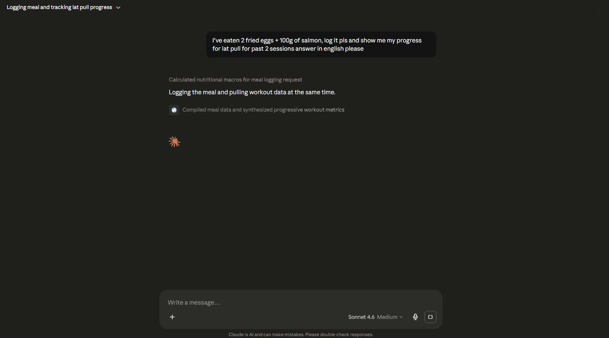
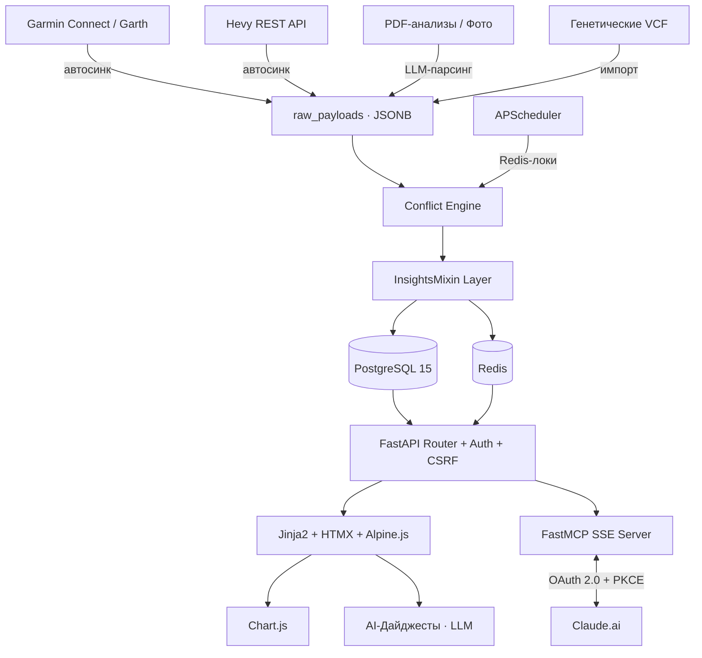
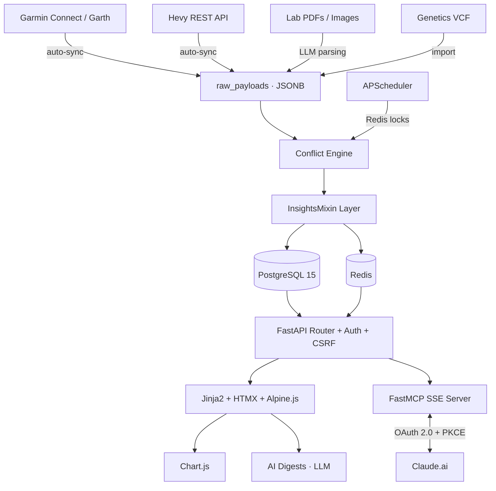

<p align="center">
  <picture>
    <source media="(prefers-color-scheme: dark)" srcset="https://img.shields.io/badge/Vitals-Personal_Health_Dashboard-F5A623?style=for-the-badge&labelColor=1a1a2e">
    
  </picture>
</p>

<p align="center">
  <strong>Self-hosted health data lake with 64 MCP tools for Claude.ai</strong><br>
  <sub>OAuth 2.0 · 12 health domains · Weight · GLP-1 · Garmin · Hevy · Nutrition · Labs · Genetics · Skincare · AI Digests</sub>
</p>

<p align="center">
  
  
  
  
  
  
  
  
  
  
  
  
  
</p>

<p align="center">
  
</p>

<p align="center">
  <a href="#vitals---личный-кабинет-здоровья"> Русский</a> &nbsp;·&nbsp;
  <a href="#vitals---personal-health-dashboard"> English</a>
</p>

---

## Vitals - Личный кабинет здоровья

**Vitals** — персональный дашборд здоровья и полноценное «озеро данных» (data lake) для одного пользователя. Система спроектирована для долгосрочного отслеживания биомаркеров, рекомпозиции тела, контроля терапии GLP-1, анализа спортивных показателей и построения еженедельных AI-отчётов с помощью языковых моделей через OpenRouter.

Главное отличие от фитнес-трекеров — **принцип максимального сохранения сырых данных**. Vitals — умный навигатор здоровья, который подсвечивает неочевидные взаимосвязи между сном, тренировками, медикаментами и весом, помогая принимать взвешенные решения. Не надзиратель — штурман.

### Зачем я это сделал

Мои данные были разбросаны по шести приложениям: Garmin, Hevy, заметки по GLP-1, таблица с анализами, файл с добавками. Ни одно из них не умело сопоставлять сон с восстановлением после тренировки или связывать побочные эффекты терапии с питанием — всё приходилось держать в голове.

Vitals написан с Claude в качестве основного инструмента разработки — но модель данных, архитектура и доменная структура мои. MCP-слой — ключевая часть: Claude может в реальном времени читать и записывать данные по всем 12 доменам, отвечая на вопросы вроде «как мой сон за последнюю неделю влияет на восстановление?» с конкретными цифрами.

### Что умеет

<p align="center">
  
</p>

<table>
<tr>
<td width="50%">

**📊 Данные и аналитика**
- 12 независимых доменов здоровья
- Автосинк Garmin Connect + Hevy API
- OCR-парсинг анализов через LLM
- Движок конфликтов: 111 курируемых правил (усвоение, фармакогенетика, дерматология, безопасность анализов, GLP-1, противопоказания)
- 7-дневное скользящее среднее + линейная регрессия
- Детекция плато на GLP-1
- Кросс-доменная хронология событий + флажки-аннотации на графиках

</td>
<td width="50%">

**🤖 AI и интеграции**
- Еженедельные AI-дайджесты (Claude / GPT)
- 64 MCP-инструмента для Claude.ai (чтение + запись + override)
- OAuth 2.0 + PKCE авторизация MCP
- Полный экспорт данных для LLM (copy-paste ready)
- Атомарный бэкап и восстановление БД
- Настраиваемые модели через OpenRouter

</td>
</tr>
<tr>
<td>

**📱 Мобильный опыт**
- PWA с установкой на Home Screen
- Адаптация под iPhone / Android
- HTMX — мгновенные переходы без перезагрузок
- Alpine.js — микро-интерактивность на клиенте
- Chart.js — адаптивные графики

</td>
<td>

**🔒 Приватность и контроль**
- Self-hosted, single-user, behind VPN
- Bcrypt-авторизация + подписанные сессии
- CSRF + Origin Guard + CSP
- Модульный дашборд — включай/выключай домены
- Все данные на вашем сервере

</td>
</tr>
</table>

---

### 📖 Содержание

- [Философия и архитектурные принципы](#-философия-и-ключевые-принципы)
- [Домены данных (12 модулей)](#-домены-данных)
- [Архитектура системы](#-архитектура-системы)
- [MCP-интеграция с Claude.ai (64 инструмента)](#-mcp-интеграция-с-claudeai)
- [Быстрый старт (Docker Compose)](#-быстрый-старт)
- [Безопасный деплой (Сетап автора)](#-безопасный-деплой-сетап-автора)
- [Параметры конфигурации (.env)](#-параметры-конфигурации)
- [Разработка и тесты](#-разработка-и-тесты)
- [Поддержать проект](#-поддержать-проект)
- [Лицензия](#-лицензия)

---

### 🧠 Философия и ключевые принципы

> [!NOTE]
> **1. Сохранность сырых данных (Raw Payloads Store)**
> Все интеграции сохраняют исходные ответы API в JSONB-таблицу `raw_payloads` параллельно со структурированными записями. Если завтра обновится парсер — вся история перепарсится без потерь.

> [!TIP]
> **2. Движок конфликтов (Conflict Engine)**
> Данные, не код: **111 курируемых правил** с источниками и уровнем доказательности (A/B/C) в `vitals/data/conflict_rules.yaml`, покрывающих усвоение нутриентов, фармакогенетику, дерматологию, безопасность по анализам, GLP-1 и противопоказания. Правила понимают не только точное совпадение, но и диапазоны (`доза ≥ 2 мг`), списки, «любое из», и разносят предупреждение по времени приёма (утро/вечер/с едой), а не только по факту совместности. Несовместимая добавка с генетикой или анализом вернёт `409 Conflict`; можно нажать «Записать всё равно (Override)» — причина запишется в лог. Каталог просматривается и включается/выключается на странице `/interactions`.

> [!IMPORTANT]
> **3. Локализованное время (Timezone Engine)**
> Время «сегодня» и границы дат строго в зоне пользователя (`VITALS_TIMEZONE`). Никаких сбитых графиков при вечерних тренировках. Всё время через `vitals/utils/timeutils`.

> [!CAUTION]
> **4. Self-hosted & Single-User Privacy**
> Биометрические данные принадлежат только вам. Деплой на собственный сервер за VPN. Сессионные куки, bcrypt-пароль, CSRF-защита.

> [!TIP]
> **5. Полная переносимость данных (Data Portability)**
> Система не запирает данные. Полная резервная копия БД (включая сырые ответы API) для миграции. Компактный текстовый экспорт (LLM-ready) для вставки в чат с Claude/ChatGPT. Атомарное восстановление из бэкапа в одной транзакции.

---

### 📊 Домены данных

Все 12 доменов объединены общим интерфейсом `InsightsMixin` (`date`, `domain`, `source` + составной индекс):

<details>
<summary><strong>⚖️ 1. Вес и состав тела</strong></summary>

- **Модели**: `WeightLog`, `BodyMeasurement`, `NoiseMarker`, `ProgressPhoto`, `BodyScan`, `BodyScanMetric`
- Расчёт % жира по формуле Navy (шея, талия, бёдра) и безжировой массы тела (LBM)
- **Состав тела InBody / МедАсс (BIA)** — опциональный модуль: загружаешь фото/PDF
  листка анализатора, vision-модель распознаёт **все** метрики (скелетная мышца, вода
  вне/внутри клеток, белок, минералы, висцеральный жир, посегментный анализ, фазовый угол,
  балл…), показывается таблица предпросмотра для правки, затем сохранение. Жир%/LBM от BIA
  и от Navy сосуществуют как разные источники и рисуются на одном графике.
- 7-дневное скользящее среднее с исключением шумовых периодов (`NoiseMarker`)
- Линейная регрессия: скорость кг/неделю и прогноз даты цели
- Прогресс-фотографии с привязкой к дате (пакетная загрузка до 5 штук)
- Приоритет источников веса: ручной ввод ≈ BIA-скан > Garmin (Garmin никогда не перекрывает)
</details>

<details>
<summary><strong>💉 2. Протокол GLP-1</strong></summary>

- **Модели**: `Injection`, `DosePhase`, `SideEffect`
- Хронологический лог инъекций (Semaglutide / Tirzepatide) с интерактивной картой точек
- Линейная шкала фаз дозировок для наложения на графики веса
- Детекция плато: если доза >14 дней и тренд <100 г/неделю → автоматическое предупреждение
</details>

<details>
<summary><strong>⌚ 3. Garmin Connect</strong></summary>

- **Модели**: `GarminDaily`, `GarminActivity`
- Автосинк: сон, HRV, пульс покоя, стресс, Body Battery, Training Readiness
- Сессия Garth: токены в Redis + бэкап на диск → минимум авторизаций
- Резервный канал: импорт JSON-экспортов из Health Auto Export
- Отображение времени последней синхронизации
</details>

<details>
<summary><strong>🏋️ 4. Тренировки Hevy</strong></summary>

- **Модели**: `HevyWorkout`, `HevyExercise`, `HevySet`
- Синхронизация силовых тренировок по API (упражнения, веса, подходы, повторения)
- Сопоставление объёма тренировок с показателями восстановления Garmin
- Отображение времени последней синхронизации
</details>

<details>
<summary><strong>🍏 5. Питание</strong></summary>

- **Модели**: `MealLog`
- Учёт приёмов пищи с калориями и макронутриентами (Б/Ж/У)
- Точное время приёма (`eaten_at`) и текстовые заметки
- Настраиваемые цели по КБЖУ через `.env` с визуализацией прогресса
- Автоматический учёт в AI-дайджестах
</details>

<details>
<summary><strong>💊 6. Каталог добавок</strong></summary>

- **Модели**: `Supplement`
- Каталог витаминов и ноотропов: дозировка, время приёма, уровень доказательности (A/B/C)
- Название автоматически распознаётся в стабильный ключ через словарь синонимов (RU/EN, ~90 добавок) — работает и с кириллицей
- Проверка конфликтов с генетикой, анализами и другими добавками через Conflict Engine (усвоение, дозировки, время приёма)
</details>

<details>
<summary><strong>🧴 7. Уход за кожей</strong></summary>

- **Модели**: `SkincareProduct`, `SkincareLog`, `SkincareObservation`
- Дневник утреннего / вечернего ухода с указанием активов (ретиноид, азелаиновая кислота, пилинг, ниацинамид+SPF, витамин C, бензоилпероксид)
- Логирование состояния кожи (жирность, сухость, высыпания)
- Автопредупреждение при конфликте активов (ретиноид+пилинг, бензоилпероксид+вит.C и т.д.) и при активном изотретиноине
</details>

<details>
<summary><strong>🧪 8. Анализы и OCR</strong></summary>

- **Модели**: `LabResult`, `LabMarker`
- Загрузка PDF / фото анализов → LLM-парсинг биомаркеров (рекомендуется `gemini-2.5-flash`)
- Расчёт отклонений (Low / High / Critical) и графики изменения показателей
- Claude может писать результаты напрямую через MCP — по одному маркеру или всей
  панелью сразу (`log_lab_results`), с тем же дедуплированием и raw-хранилищем,
  что и у загрузки файла
</details>

<details>
<summary><strong>🧬 9. Генетика (VCF)</strong></summary>

- **Модели**: `GeneticVariant`
- Парсер VCF-файлов → сопоставление SNP с каталогом предрасположенностей (HFE, MTHFR, G6PD, CYP1A2, COMT и др.)
- Источник данных для Conflict Engine — фармакогенетические правила при назначении добавок (например, носительство гемохроматоза блокирует железо)
</details>

<details>
<summary><strong>🎯 10. Цели и вехи</strong></summary>

- **Модели**: `Milestone`
- Интерактивные карточки с целевыми значениями и дедлайнами
- Динамический расчёт % выполнения и прогноз оставшегося времени
</details>

<details>
<summary><strong>🤖 11. AI-дайджесты</strong></summary>

- **Модели**: `WeeklyDigest`
- Еженедельный LLM-отчёт по всем доменам (рекомендуется `claude-sonnet-4.6`)
- Фокус на связях: *«HRV упал из-за тренировочного объёма Hevy на фоне плато GLP-1»*
</details>

<details>
<summary><strong>🔗 12. MCP-интеграция с Claude.ai</strong></summary>

- FastMCP-сервер на `/mcp` (SSE-транспорт)
- OAuth 2.0 + PKCE + Bearer-токены
- 64 инструмента: 28 для чтения + 36 для записи данных (+ 2 ресурса и промпт)
- Подробнее → [раздел MCP](#-mcp-интеграция-с-claudeai)
</details>

---

### 🏗️ Архитектура системы



| Слой | Ответственность |
| :--- | :--- |
| **`vitals/`** (ядро) | Модели, сервисы, бизнес-логика. Не знает о FastAPI. Импортируется в скрипты и тесты. |
| **`web/`** (доставка) | FastAPI-роутинг, авторизация, CSRF, шаблоны Jinja2. Вызывает сервисы, не содержит бизнес-логику. |
| **Фронтенд** | HTML-over-the-wire: HTMX + Alpine.js + Chart.js. PWA-first, mobile-адаптированный. |

---

### 🔗 MCP-интеграция с Claude.ai

Встроенный сервер [FastMCP](https://github.com/jlowin/fastmcp) доступен на `/mcp` (SSE-транспорт). Авторизация: OAuth 2.0 + PKCE с верификацией Bearer-токенов. Настраивается в веб-интерфейсе (раздел настроек).

**64 инструмента** — Claude может полноценно читать и записывать данные во все домены. Плюс 2 ресурса (`vitals://profile`, `vitals://digest/latest`) и промпт `weekly_review`.

#### Чтение (28 инструментов)

| Инструмент | Описание |
| :--- | :--- |
| `get_user_profile` | Физические параметры, цели, программа тренировок |
| `get_weight_logs` | История взвешиваний, замеры тела, периоды шума |
| `get_glp1_logs` | Инъекции, фазы дозировок GLP-1, побочные эффекты |
| `get_garmin_metrics` | HRV, сон, пульс покоя, активность |
| `get_hevy_workouts` | Силовые тренировки с подходами и весами |
| `get_supplements_catalog` | Каталог добавок с дозировками и уровнями доказательности |
| `get_skincare_logs` | Рутина ухода и наблюдения за состоянием кожи |
| `get_lab_results` | Результаты анализов (биомаркер, значение, референс, флаг отклонения); фильтр по маркеру и/или диапазону дат |
| `get_genetics_snps` | Генетические варианты (rsid, гены) |
| `get_active_alerts` | Нерешённые системные предупреждения |
| `get_weekly_digests` | Архив AI-дайджестов |
| `get_nutrition_summary` | Суточная сводка питания (КБЖУ) и прогресс по целям |
| `search_meals` | Поиск приёмов пищи по имени и/или дате |
| `get_measurements` | Замеры тела (шея, талия, бёдра, % жира, LBM) |
| `get_body_scans` | Замеры состава тела InBody / МедАсс со всеми метриками |
| `get_body_scan` | Один замер состава тела с полным листком метрик |
| `get_body_metric_history` | История одной метрики состава тела (SMM, фазовый угол…) |
| `get_notes` | Записи с заметками из всех доменов |
| `check_supplement_conflicts` | Проверка добавки (по названию, RU/EN) на конфликты с генетикой, анализами, другими добавками и уходом за кожей |
| `list_conflict_rules` | Список курируемых правил конфликтов, фильтр по домену и/или категории |
| `check_conflicts` | Проверка произвольного состояния любого домена на активные правила конфликтов (без сохранения) |
| `get_timeline` | Кросс-доменная лента событий (ручные аннотации + смены дозы GLP-1, анализы, BIA-сканы, достигнутые цели, шумные периоды) |
| `get_full_snapshot` | Кросс-доменный срез за период одним вызовом (тренд веса, GLP-1, свежие анализы, активность/восстановление, тренировки, питание, кожа, цели) |
| `export_everything` | Полный компактный LLM-экспорт всей истории по всем доменам за один вызов |
| `get_data_overview` | Карта данных: по каждому домену число строк, диапазон дат, дата последнего обновления |
| `get_milestones` | Карточки целей с расчётом прогресса (фильтр по статусу) |
| `get_modules` | Какие опциональные модули включены; какие ядровые (заблокированы) vs опциональные |
| `get_trend` | Тренд метрики: наклон (день/неделя), скользящее среднее, прогноз даты до цели (с вырезанным шумом для веса) |

#### Запись (36 инструментов)

| Инструмент | Описание |
| :--- | :--- |
| `log_meal` | Запись приёма пищи с калориями и макро (Б/Ж/У) |
| `update_meal` | Обновление существующей записи о еде |
| `delete_meal` | Удаление записи о еде |
| `log_weight` | Запись веса (перекрывает Garmin за ту же дату) |
| `delete_weight` | Удаление записи веса (реактивация следующей по приоритету) |
| `log_glp1` | Запись инъекции GLP-1 (препарат, доза, место) |
| `log_skincare` | Запись/обновление дневного чек-листа ухода (upsert) |
| `log_measurement` | Запись замеров тела (авто-расчёт Navy % жира) |
| `log_body_scan` | Запись замера состава тела из метрик (мост в домен веса) |
| `delete_body_scan` | Удаление замера состава тела (с метриками) |
| `log_lab_result` | Запись одного биомаркера (авто-расчёт флага отклонения) |
| `log_lab_results` | Запись всей панели анализов за раз (список маркеров → результаты + дедупликация) |
| `delete_lab_result` | Удаление результата анализа |
| `log_note` | Добавление заметки к записи любого домена (включая анализы) |
| `log_event` | Ручная аннотация хронологии (поездка, болезнь, смена протокола) — флажок на всех графиках |
| `create_milestone` | Создать карточку цели (целевое значение, дедлайн) |
| `update_milestone` | Обновить цель (в т.ч. статус: достигнута/пропущена/пауза) |
| `delete_milestone` | Удалить цель |
| `update_glp1` | Редактировать инъекцию GLP-1 (с конфликт-гейтом) |
| `delete_glp1` | Удалить инъекцию GLP-1 |
| `log_side_effect` | Записать побочный эффект GLP-1 (тип, тяжесть 1–5) |
| `delete_side_effect` | Удалить побочный эффект |
| `add_dose_phase` | Добавить фазу дозировки GLP-1 (наложение на график веса) |
| `delete_dose_phase` | Удалить фазу дозировки |
| `log_skincare_observation` | Записать наблюдение за кожей (воспаление, ПВГ, зона) |
| `delete_skincare_observation` | Удалить наблюдение за кожей |
| `add_supplement` | Добавить добавку в каталог (конфликт-гейт) |
| `update_supplement` | Обновить добавку в каталоге |
| `set_supplement_active` | Включить/выключить добавку (конфликт-гейт при включении) |
| `delete_supplement` | Удалить добавку из каталога |
| `update_measurement` | Редактировать замер тела (пересчёт Navy % жира / LBM) |
| `delete_measurement` | Удалить замер тела |
| `add_noise_marker` | Отметить период как шумовой (исключается из тренда веса) |
| `delete_noise_marker` | Удалить шумовой период (диапазон возвращается в тренд) |
| `set_module` | Включить/выключить опциональный модуль |
| `generate_digest_now` | Сгенерировать свежий еженедельный AI-дайджест сейчас |

> [!TIP]
> **Override-флоу.** Все записывающие инструменты, проходящие движок конфликтов (вес, GLP-1, добавки, кожа, замеры, состав тела), принимают `override=true`. При жёстком блоке инструмент возвращает `{"blocked": true, "violations": [...]}` вместо сохранения — повтор вызова с `override=true` сохраняет (аналог кнопки «Записать всё равно» в UI).

#### Пример диалога с Claude

```
Пользователь: Как у меня дела за последние 2 недели? Вес, тренировки, сон — общая картина.

Claude: [вызывает get_weight_logs, get_hevy_workouts, get_garmin_metrics]

Вес: 89.2 → 87.8 кг за 14 дней (−1.4 кг, ~0.7 кг/неделю — в рамках плана).

Тренировки: 4 сессии (2× верх, 2× ноги). Прогрессия: жим лёжа +5 кг,
тяга верхнего блока +7.5 кг.

Сон: в среднем 7ч 12мин, HRV снижается последние 3 дня — вероятно,
накопленная усталость после тренировок. Body Battery восстанавливается нормально.

Рекомендация: восстановление достаточное, следующую тренировку можно проводить.
```

---

### 🚀 Быстрый старт

#### 1. Клонируйте и настройте окружение

```bash
git clone https://github.com/ilodezis/vitals.git
cd vitals
cp .env.example .env
```

#### 2. Сгенерируйте секреты

```bash
# Ключ для подписи сессионных кук
python -c "import secrets; print(secrets.token_urlsafe(48))"

# Bcrypt-хеш пароля для входа
python -c "import bcrypt; print(bcrypt.hashpw(b'ваш-пароль', bcrypt.gensalt(4)).decode())"
```

#### 3. Заполните `.env`

```env
VITALS_SESSION_SECRET="результат-первой-команды"
VITALS_AUTH_USERNAME="your-username"
VITALS_AUTH_PASSWORD_HASH="результат-второй-команды"
```

#### 4. Запустите

```bash
docker compose up -d --build
```

> [!NOTE]
> Миграции Alembic применяются автоматически при старте `vitals_app`. PostgreSQL 15 — внутри Docker-сети.

#### 5. Проверьте

Дашборд: `http://127.0.0.1:8000`

```bash
curl -s http://127.0.0.1:8000/health
```

---

### 🛡️ Безопасный деплой (Сетап автора)

Поскольку Vitals содержит чувствительные медицинские, генетические и персональные биометрические данные, **категорически не рекомендуется оставлять приложение открытым для всего интернета**. По умолчанию в `docker-compose.yml` порты привязаны только к локальному адресу (`127.0.0.1:8000`), чтобы никто извне не мог получить доступ напрямую.

#### Вариант А: Cloudflare Tunnel (Рекомендуется автором)
Это самый простой и надежный способ опубликовать приложение с SSL-сертификатом без необходимости открывать порты наружу (ваш сервер остается невидимым для сканеров портов).

1. **Регистрация домена**: Добавьте свой домен в Cloudflare.
2. **Создание туннеля**: В панели [Cloudflare Zero Trust](https://one.dash.cloudflare.com/) перейдите в **Access -> Tunnels** и создайте новый туннель (например, `vitals-tunnel`).
3. **Установка cloudflared**: Скопируйте предоставленную Cloudflare команду установки для вашей ОС (Ubuntu/Debian) и выполните ее на VPS. Она установит и запустит демон `cloudflared` как системную службу.
4. **Маршрутизация**: В настройках туннеля во вкладке **Public Hostname** укажите:
   - **Subdomain/Domain**: Например, `vitals.yourdomain.com`
   - **Service Type**: `HTTP`
   - **URL**: `localhost:8000` (или `127.0.0.1:8000`)
5. **Дополнительная защита (Cloudflare Access)**:
   - Чтобы защитить приложение еще до страницы авторизации, в панели Zero Trust перейдите в **Access -> Applications** и создайте приложение для вашего домена (например, `vitals.yourdomain.com`).
   - Настройте политику доступа (Access Policy), разрешающую вход только вашему email-адресу через одноразовые коды (One-Time PIN) или социальные провайдеры (Google/GitHub). Теперь перед входом в Vitals нужно будет подтвердить свою личность в Cloudflare.

---

#### Вариант Б: Классический Nginx реверс-прокси + SSL + VPN/Basic Auth
Классический подход с веб-сервером Nginx в качестве прокси-сервера.

1. **Настройка DNS**: Направьте A-запись домена (например, `vitals.yourdomain.com`) на публичный IP-адрес вашей VPS.
2. **Установка Nginx**:
   ```bash
   sudo apt update
   sudo apt install nginx -y
   ```
3. **Конфигурация хоста**: Создайте файл `/etc/nginx/sites-available/vitals` со следующим содержимым:
   ```nginx
   server {
       listen 80;
       server_name vitals.yourdomain.com;

       location / {
           proxy_pass http://127.0.0.1:8000;
           proxy_set_header Host $host;
           proxy_set_header X-Real-IP $remote_addr;
           proxy_set_header X-Forwarded-For $proxy_add_x_forwarded_for;
           proxy_set_header X-Forwarded-Proto $scheme;
           
           # Отключаем ограничение на размер загружаемых PDF-анализов и фото
           client_max_body_size 20M;
       }
   }
   ```
   Активируйте конфиг и перезапустите Nginx:
   ```bash
   sudo ln -s /etc/nginx/sites-available/vitals /etc/nginx/sites-enabled/
   sudo nginx -t && sudo systemctl restart nginx
   ```
4. **Установка SSL-сертификата (Let's Encrypt)**:
   ```bash
   sudo apt install certbot python3-certbot-nginx -y
   sudo certbot --nginx -d vitals.yourdomain.com
   ```
5. **Ограничение доступа (на выбор)**:
   - **Через VPN (Tailscale/WireGuard)**: Настройте Nginx так, чтобы он слушал порт `443` только на внутреннем IP-адресе VPN-интерфейса (например, `listen 100.x.x.x:443 ssl`), а не на внешнем интерфейсе сервера.
   - **Через HTTP Basic Auth**: Защитите роут паролем. Сгенерируйте файл с паролями:
     ```bash
     sudo apt install apache2-utils -y
     sudo htpasswd -c /etc/nginx/.htpasswd username
     ```
     Добавьте в блок `location /` конфигурации Nginx:
     ```nginx
     auth_basic "Private Vitals Access";
     auth_basic_user_file /etc/nginx/.htpasswd;
     ```

---

#### Вариант В: Просто повесить на свой домен (через Cloudflare прокси)
Самый стандартный путь, если у вас есть домен, делегированный на Cloudflare, и вы хотите простой публичный доступ с SSL без дополнительного VPN или авторизации со стороны Cloudflare Zero Trust.

1. **Настройка DNS в Cloudflare**:
   - Создайте A-запись (например, `vitals.yourdomain.com`), указывающую на публичный IP-адрес вашей VPS.
   - Убедитесь, что включен прокси-режим (**Proxied** / оранжевое облако). Это скроет реальный IP-адрес вашей VPS от внешнего мира и обеспечит встроенную защиту от DDoS.
2. **Настройка SSL/TLS в Cloudflare**:
   - В панели управления Cloudflare перейдите в раздел **SSL/TLS -> Overview**.
   - Установите режим шифрования в **Full** или **Full (strict)**.
3. **Установка Nginx на VPS**:
   ```bash
   sudo apt update
   sudo apt install nginx -y
   ```
4. **Конфигурация Nginx**:
   Создайте файл `/etc/nginx/sites-available/vitals` с проксированием трафика на локальный порт 8000:
   ```nginx
   server {
       listen 80;
       server_name vitals.yourdomain.com;

       client_max_body_size 20M;

       location / {
           proxy_pass http://127.0.0.1:8000;
           proxy_set_header Host $host;
           proxy_set_header X-Real-IP $remote_addr;
           proxy_set_header X-Forwarded-For $proxy_add_x_forwarded_for;
           proxy_set_header X-Forwarded-Proto $scheme;
       }
   }
   ```
   Активируйте конфигурацию и перезапустите Nginx:
   ```bash
   sudo ln -s /etc/nginx/sites-available/vitals /etc/nginx/sites-enabled/
   sudo nginx -t && sudo systemctl restart nginx
   ```
5. **SSL-сертификаты (выберите один из вариантов)**:
   - **Origin Certificate от Cloudflare** (Рекомендуется):
     - В панели Cloudflare перейдите в **SSL/TLS -> Origin Server** и нажмите **Create Certificate**.
     - Скопируйте содержимое приватного ключа и сертификата и сохраните их на VPS (например, в `/etc/ssl/private/cloudflare.key` и `/etc/ssl/certs/cloudflare.pem`).
     - Обновите конфигурацию Nginx, переведя ее на порт 443 с использованием этих сертификатов:
       ```nginx
       server {
           listen 80;
           server_name vitals.yourdomain.com;
           return 301 https://$host$request_uri;
       }

       server {
           listen 443 ssl;
           server_name vitals.yourdomain.com;

           ssl_certificate /etc/ssl/certs/cloudflare.pem;
           ssl_certificate_key /etc/ssl/private/cloudflare.key;

           client_max_body_size 20M;

           location / {
               proxy_pass http://127.0.0.1:8000;
               proxy_set_header Host $host;
               proxy_set_header X-Real-IP $remote_addr;
               proxy_set_header X-Forwarded-For $proxy_add_x_forwarded_for;
               proxy_set_header X-Forwarded-Proto $scheme;
           }
       }
       ```
       Перезапустите Nginx: `sudo systemctl restart nginx`.
   - **Использование Let's Encrypt**:
     - Если вы не хотите использовать Origin-сертификаты Cloudflare, просто получите стандартный сертификат Let's Encrypt через Certbot:
       ```bash
       sudo apt install certbot python3-certbot-nginx -y
       sudo certbot --nginx -d vitals.yourdomain.com
       ```

---

### ⚙️ Параметры конфигурации

<details>
<summary><strong>Инфраструктура</strong></summary>

| Переменная | Описание | Дефолт |
| :--- | :--- | :--- |
| `VITALS_DATABASE_URL` | PostgreSQL (asyncpg) | `postgresql+asyncpg://...` |
| `VITALS_REDIS_URL` | Redis для кэша и локов | `redis://vitals_redis:6379/0` |
| `VITALS_TIMEZONE` | Зона пользователя | `Europe/Chisinau` |
</details>

<details>
<summary><strong>Авторизация и безопасность</strong></summary>

| Переменная | Описание | Дефолт |
| :--- | :--- | :--- |
| `VITALS_SESSION_SECRET` | Ключ подписи сессий | *Обязательный* |
| `VITALS_AUTH_USERNAME` | Имя пользователя | *Обязательный* |
| `VITALS_AUTH_PASSWORD_HASH` | Bcrypt-хеш пароля | *Обязательный* |
| `VITALS_SESSION_TTL` | Время жизни сессии (сек) | `2592000` (30 дней) |
| `VITALS_COOKIE_SECURE` | Флаг Secure для кук | `true` |
| `VITALS_COOKIE_SAMESITE` | Политика SameSite | `lax` |
</details>

<details>
<summary><strong>Профиль пользователя</strong></summary>

| Переменная | Описание | Дефолт |
| :--- | :--- | :--- |
| `VITALS_HEIGHT_CM` | Рост (см) | `175` |
| `VITALS_SEX` | Пол (`male` / `female`) | `male` |
| `VITALS_USER_AGE` | Возраст | `25` |
| `VITALS_BODY_FAT_SOURCE` | Главный источник жира%/LBM: `latest` / `navy` / `bia` | `latest` |
| `VITALS_USER_PROGRAM` | Описание программы | *Встроено* |
| `VITALS_USER_GOALS` | Цели (через запятую) | `снижение жира, сохранение мышц` |
</details>

<details>
<summary><strong>Цели питания</strong></summary>

| Переменная | Описание | Дефолт |
| :--- | :--- | :--- |
| `VITALS_NUTRITION_PROTEIN_TARGET_G` | Суточный белок (г) | `150` |
| `VITALS_NUTRITION_CALORIES_MIN` | Минимум ккал | `1300` |
| `VITALS_NUTRITION_CALORIES_MAX` | Максимум ккал | `1700` |
</details>

<details>
<summary><strong>Интеграции и AI</strong></summary>

| Переменная | Описание | Дефолт |
| :--- | :--- | :--- |
| `VITALS_OPENROUTER_API_KEY` | API-ключ OpenRouter | *Опционально* |
| `VITALS_LLM_MODEL_DIGEST` | Модель для дайджестов | `anthropic/claude-sonnet-4.6` |
| `VITALS_LLM_MODEL_PARSER` | Модель для OCR анализов | `google/gemini-2.5-flash` |
| `VITALS_HEVY_API_KEY` | API-ключ Hevy | *Опционально* |
| `VITALS_GARMIN_EMAIL` | Email Garmin Connect | *Опционально* |
| `VITALS_GARMIN_PASSWORD` | Пароль Garmin Connect | *Опционально* |
| `VITALS_GARMIN_TOKEN_DIR` | Путь к токенам Garmin | `/data/garmin_session` |
| `VITALS_MCP_CLIENT_ID` | OAuth Client ID для MCP | `vitals-claude-connector` |
| `VITALS_MCP_CLIENT_SECRET` | OAuth Client Secret для MCP | *Обязательно* |
</details>

---

### 🛠️ Разработка и тесты

#### Локальное окружение

```bash
python -m venv .venv
.venv\Scripts\activate          # Windows
source .venv/bin/activate       # macOS/Linux
pip install -r requirements-dev.txt
```

#### Dev-сервер (без Docker)

```bash
python run_local.py
```

Автоматически поднимает SQLite + FakeRedis. Логин по умолчанию: `timur` / `password`. Адрес: `http://127.0.0.1:8000`.

#### Демо-данные

```bash
python scripts/seed_demo.py
```

Засевает локальную базу правдоподобным набором данных по всем доменам (вес, Garmin, тренировки, питание, GLP-1, анализы, добавки, генетика, уход за кожей). Идемпотентный — можно запускать повторно.

#### Тесты

```bash
# Юнит-тесты (SQLite, мгновенно)
python -m pytest -q

# Интеграционные (Postgres Docker)
bash scripts/test_postgres.sh
```

---

### ☕ Поддержать проект

> [!TIP]
> Если **Vitals** помогает вам отслеживать показатели здоровья и облегчает жизнь, вы можете поддержать проект:
>
> * **Карты РФ (CloudTips)**: [pay.cloudtips.ru/p/5bb82648](https://pay.cloudtips.ru/p/5bb82648)
> * **Международные карты (Ko-fi)**: [ko-fi.com/ilodezis](https://ko-fi.com/ilodezis)
> * **USDT (TRC-20)**: `TV6bMburcEjgkinkZBvt9DonkyiaP7TqHG`
> * **USDT (Arbitrum One)**: `0x3eac15f5d07bba100d4038cad603e420a84753bb`

---

### 📄 Лицензия

**PolyForm Noncommercial License 1.0.0** — использование и модификация разрешены в некоммерческих целях. Коммерческое использование запрещено. Подробности: [LICENSE](LICENSE).

---
---

## Vitals - Personal Health Dashboard

**Vitals** is a personal health dashboard and data lake designed for a single user. Built for long-term tracking of biomarkers, body recomposition, GLP-1 therapy, athletic performance, and AI-powered weekly analytical digests via OpenRouter LLMs.

Unlike typical fitness trackers, Vitals prioritizes **preserving raw historical data**. It serves as a smart wellness navigator — uncovering correlations between sleep, workouts, supplements, and body composition. Not a watchdog — a co-pilot.

### Why I built this

My data was scattered across six apps: Garmin, Hevy, GLP-1 notes, a spreadsheet with lab results, a file with supplements. None of them could cross-reference sleep with training recovery or link therapy side effects to nutrition — I had to keep it all in my head.

Built with Claude as the primary coding tool — but the data model, architecture, and domain design are mine. The MCP layer is the key part: Claude can read and write data across all 12 domains in real time, answering questions like "how did my sleep this week affect my recovery?" with actual numbers.

<p align="center">
  
</p>

### What it does

<p align="center">
  
</p>

<table>
<tr>
<td width="50%">

**📊 Data & Analytics**
- 12 independent health domains
- Auto-sync Garmin Connect + Hevy API
- OCR lab report parsing via LLM
- Conflict engine: 111 curated rules (absorption, pharmacogenomics, dermatology, lab safety, GLP-1, contraindications)
- 7-day moving average + linear regression
- GLP-1 plateau detection
- Cross-domain event timeline + chart annotation flags

</td>
<td width="50%">

**🤖 AI & Integrations**
- Weekly AI digests (Claude / GPT via OpenRouter)
- 64 MCP tools for Claude.ai (read + write + override)
- OAuth 2.0 + PKCE authorization for MCP
- Full data export for LLM (copy-paste ready)
- Atomic database backup & restore
- Configurable models via OpenRouter

</td>
</tr>
<tr>
<td>

**📱 Mobile Experience**
- PWA with Home Screen install
- iPhone / Android adapted
- HTMX — instant transitions, no page reloads
- Alpine.js — client-side micro-interactivity
- Chart.js — responsive charts

</td>
<td>

**🔒 Privacy & Control**
- Self-hosted, single-user, behind VPN
- Bcrypt auth + signed session cookies
- CSRF + Origin Guard + CSP
- Modular dashboard — toggle domains on/off
- All data stays on your server

</td>
</tr>
</table>

---

### 📖 Table of Contents

- [Core Philosophy](#-core-philosophy)
- [Supported Domains (12 modules)](#-supported-domains)
- [Technical Architecture](#-technical-architecture)
- [MCP Integration with Claude.ai (64 tools)](#-mcp-integration-with-claudeai)
- [Quick Start (Docker Compose)](#-quick-start)
- [Secure Deployment (Creator's Setup)](#-secure-deployment-creators-setup)
- [Configuration (.env)](#-configuration)
- [Development & Testing](#-development--testing)
- [Support the Project](#-support-the-project)
- [License](#-license)

---

### 🧠 Core Philosophy

> [!NOTE]
> **1. Raw Data Preservation**
> All API integrations preserve original JSON payloads in a JSONB `raw_payloads` table alongside normalized records. If a parser changes — the entire history can be re-processed with zero loss.

> [!TIP]
> **2. Resilient Conflict Engine**
> Data, not code: **111 curated rules** with sources and an evidence tier (A/B/C) in `vitals/data/conflict_rules.yaml`, covering nutrient absorption, pharmacogenomics, dermatology, lab safety, GLP-1, and contraindications. Rules understand more than exact matches — comparisons (`dose ≥ 2mg`), lists, "any of", and time-of-day separation (morning/evening/with food), not just simultaneous presence. A supplement clashing with genetics or a lab result returns `409 Conflict`; users can explicitly override with an audit note. Browse and toggle the whole catalog on `/interactions`.

> [!IMPORTANT]
> **3. Localized Time Boundaries**
> Daily resets and calendar math resolve against the user's timezone (`VITALS_TIMEZONE`), not the server clock. No more split days from late-night workouts. All time via `vitals/utils/timeutils`.

> [!CAUTION]
> **4. Single-User Self-Hosted Privacy**
> Your biometrics belong to you. Designed for deployment behind a VPN. Secure session cookies, bcrypt passwords, CSRF protection.

> [!TIP]
> **5. End-to-End Data Portability**
> Full database backup (including raw API payloads) for migration. Curated, secret-free text export designed for pasting into LLM chats (Claude, ChatGPT). Atomic restore within a single database transaction.

---

### 📊 Supported Domains

All 12 domains share the `InsightsMixin` interface (`date`, `domain`, `source` + composite index):

<details>
<summary><strong>⚖️ 1. Weight & Body Composition</strong></summary>

- **Models**: `WeightLog`, `BodyMeasurement`, `NoiseMarker`, `ProgressPhoto`, `BodyScan`, `BodyScanMetric`
- US Navy body fat % formula (neck, waist, hips) + Lean Body Mass (LBM)
- **InBody / МедАсс (BIA) body composition** — optional module: upload a photo/PDF of
  the analyzer sheet, a vision model extracts **every** metric (skeletal muscle, intra-/
  extra-cellular water, protein, minerals, visceral fat, segmental analysis, phase angle,
  device score…), an editable preview lets you fix values, then save. BIA and Navy body-fat%
  /LBM coexist as separate sources and are drawn on the same chart.
- 7-day moving average with noise period exclusion (`NoiseMarker`)
- Linear regression: weekly rate (kg/week) + goal date projection
- Progress photos with calendar linking (batch upload up to 5 at once)
- Weight source priority: manual ≈ BIA scan > Garmin (Garmin never supersedes)
</details>

<details>
<summary><strong>💉 2. GLP-1 Protocol</strong></summary>

- **Models**: `Injection`, `DosePhase`, `SideEffect`
- Chronological injection log (Semaglutide / Tirzepatide) with interactive site map
- Dose phase overlays on weight charts for correlation
- Plateau detection: dose >14 days + trend <100g/week → automatic warning
</details>

<details>
<summary><strong>⌚ 3. Garmin Connect</strong></summary>

- **Models**: `GarminDaily`, `GarminActivity`
- Auto-sync: sleep, HRV, resting HR, stress, Body Battery, Training Readiness
- Garth session tokens cached in Redis + disk backup → minimal re-auth
- Fallback: direct Health Auto Export JSON import
- Last sync timestamp display
</details>

<details>
<summary><strong>🏋️ 4. Hevy Workouts</strong></summary>

- **Models**: `HevyWorkout`, `HevyExercise`, `HevySet`
- API sync: exercises, sets, reps, weight
- Cross-reference training volume with Garmin recovery metrics
- Last sync timestamp display
</details>

<details>
<summary><strong>🍏 5. Nutrition</strong></summary>

- **Models**: `MealLog`
- Meal logging with calories and macros (protein, fat, carbs)
- Wall-clock consumption time (`eaten_at`) + text notes
- Configurable macro targets via `.env` with dashboard progress gauges
- Auto-included in weekly AI digests
</details>

<details>
<summary><strong>💊 6. Supplements Catalog</strong></summary>

- **Models**: `Supplement`
- Supplement database with dosages, timing, evidence tiers (A/B/C)
- Free-text names resolve to a stable key via an alias dictionary (RU/EN, ~90 supplements) — works with Cyrillic names too
- Conflict checks against genetics, labs, and concurrent substances via the Conflict Engine (absorption, dosing, timing)
</details>

<details>
<summary><strong>🧴 7. Skincare Log</strong></summary>

- **Models**: `SkincareProduct`, `SkincareLog`, `SkincareObservation`
- Morning / evening routine logs with product actives (retinoid, azelaic acid, peel, niacinamide+SPF, vitamin C, benzoyl peroxide)
- Skin status tracking (hydration, oiliness, breakouts)
- Auto-warning for conflicting actives (retinoid+peel, benzoyl peroxide+vitamin C, etc.) and active isotretinoin
</details>

<details>
<summary><strong>🧪 8. Lab Results & OCR</strong></summary>

- **Models**: `LabResult`, `LabMarker`
- Upload PDF / image → LLM parses biomarkers (recommended: `gemini-2.5-flash`)
- Out-of-range flagging (Low / High / Critical) + interactive history charts
- Claude can write results straight through MCP — one marker at a time or a
  whole panel at once (`log_lab_results`), with the same dedup and raw-payload
  storage as a file upload
</details>

<details>
<summary><strong>🧬 9. Genetics (VCF)</strong></summary>

- **Models**: `GeneticVariant`
- VCF file parser → health-relevant SNPs (HFE, MTHFR, G6PD, CYP1A2, COMT, and more)
- Feeds pharmacogenomic rules into the Conflict Engine (e.g. hemochromatosis carrier status blocks iron supplementation)
</details>

<details>
<summary><strong>🎯 10. Milestones & Goals</strong></summary>

- **Models**: `Milestone`
- Interactive goal cards with numeric targets and deadlines
- Real-time progress % based on active weight metrics
</details>

<details>
<summary><strong>🤖 11. Weekly AI Digests</strong></summary>

- **Models**: `WeeklyDigest`
- Weekly LLM digest across all domains (recommended: `claude-sonnet-4.6`)
- Focused on causal links: *"HRV recovered as training volume decreased, breaking the weight stall on the current GLP-1 phase"*
</details>

<details>
<summary><strong>🔗 12. Claude.ai MCP Integration</strong></summary>

- FastMCP server at `/mcp` (SSE transport)
- OAuth 2.0 + PKCE + Bearer tokens
- 64 tools: 28 read + 36 write (+ 2 resources and a prompt)
- Details → [MCP section](#-mcp-integration-with-claudeai)
</details>

---

### 🏗️ Technical Architecture



| Layer | Responsibility |
| :--- | :--- |
| **`vitals/`** (core) | Models, services, business logic. Zero web dependencies. Importable in scripts and tests. |
| **`web/`** (delivery) | FastAPI routing, auth, CSRF, Jinja2 templates. Calls services — contains no business logic. |
| **Frontend** | HTML-over-the-wire: HTMX + Alpine.js + Chart.js. PWA-first, mobile-adapted. |

---

### 🔗 MCP Integration with Claude.ai

Built-in [FastMCP](https://github.com/jlowin/fastmcp) server at `/mcp` (SSE transport). Authorization: OAuth 2.0 + PKCE with signed Bearer token verification. Configured in the web dashboard settings.

**64 tools** — Claude can fully read and write data across all domains. Plus 2 resources (`vitals://profile`, `vitals://digest/latest`) and a `weekly_review` prompt.

#### Read (28 tools)

| Tool | Description |
| :--- | :--- |
| `get_user_profile` | Physical profile, goals, training program |
| `get_weight_logs` | Weight history, body measurements, noise markers |
| `get_glp1_logs` | GLP-1 injections, dose phases, side effects |
| `get_garmin_metrics` | HRV, sleep, resting HR, activities |
| `get_hevy_workouts` | Strength workouts with sets, reps, weights |
| `get_supplements_catalog` | Supplements with dosages and evidence tiers |
| `get_skincare_logs` | Skincare routine logs and skin observations |
| `get_lab_results` | Lab results (biomarker, value, reference range, out-of-range flag); filterable by marker and/or date range |
| `get_genetics_snps` | Genetic SNPs (rsid, genes) |
| `get_active_alerts` | Unresolved warnings and conflict notifications |
| `get_weekly_digests` | Historical AI digest archive |
| `get_nutrition_summary` | Daily nutrition summary (calories, macros) and goal progress |
| `search_meals` | Search meals by name and/or date |
| `get_measurements` | Body measurements (neck, waist, hips, body-fat %, LBM) |
| `get_body_scans` | InBody / МедАсс body-composition scans with every metric |
| `get_body_scan` | A single body-composition scan with its full metric sheet |
| `get_body_metric_history` | History of one body-composition metric (SMM, phase angle…) |
| `get_notes` | Records with notes across all domains |
| `check_supplement_conflicts` | Check a supplement (by name, RU/EN) against genetics, labs, other supplements, and skincare |
| `list_conflict_rules` | List the curated conflict-rule catalog, filterable by domain and/or category |
| `check_conflicts` | Check an arbitrary state against active conflict rules for any domain (read-only, no save) |
| `get_timeline` | Cross-domain event feed (manual annotations + GLP-1 dose changes, lab draws, BIA scans, achieved goals, noisy periods) |
| `get_full_snapshot` | One cross-domain snapshot for a period (weight trend, GLP-1, recent labs, activity/recovery, workouts, nutrition, skincare, goals) |
| `export_everything` | The entire history as one compact, LLM-ready export across all domains |
| `get_data_overview` | Per-domain map: row count, date range, last-updated timestamp |
| `get_milestones` | Goal cards with computed progress (filter by status) |
| `get_modules` | Which optional modules are enabled; which keys are core (locked) vs optional |
| `get_trend` | Metric trend: slope (day/week), latest rolling mean, projected date-to-target (weight noise excluded) |

#### Write (36 tools)

| Tool | Description |
| :--- | :--- |
| `log_meal` | Record a meal with calories and macros |
| `update_meal` | Update an existing meal entry |
| `delete_meal` | Delete a meal entry |
| `log_weight` | Record weight (overrides Garmin for the same date) |
| `delete_weight` | Delete a weight entry (reactivates next priority) |
| `log_glp1` | Record a GLP-1 injection (drug, dose, site) |
| `log_skincare` | Record/update daily skincare checklist (upsert) |
| `log_measurement` | Record body measurements (auto-computes Navy body-fat %) |
| `log_body_scan` | Record a body-composition scan from metrics (bridges into weight) |
| `delete_body_scan` | Delete a body-composition scan (and its metrics) |
| `log_lab_result` | Record a single biomarker (auto-computes the out-of-range flag) |
| `log_lab_results` | Record a whole lab panel at once (a list of markers → results + dedup) |
| `delete_lab_result` | Delete a lab result |
| `log_note` | Add a note to any domain record (including lab results) |
| `log_event` | Manual timeline annotation (trip, illness, protocol change) — a flag on every chart |
| `create_milestone` | Create a goal card (target value, deadline) |
| `update_milestone` | Update a goal (incl. status: achieved/missed/paused) |
| `delete_milestone` | Delete a goal |
| `update_glp1` | Edit a GLP-1 injection (conflict-gated) |
| `delete_glp1` | Delete a GLP-1 injection |
| `log_side_effect` | Record a GLP-1 side effect (type, severity 1–5) |
| `delete_side_effect` | Delete a side effect |
| `add_dose_phase` | Add a GLP-1 dose phase (overlaid on the weight chart) |
| `delete_dose_phase` | Delete a dose phase |
| `log_skincare_observation` | Record a skin observation (inflammation, PIH, zone) |
| `delete_skincare_observation` | Delete a skin observation |
| `add_supplement` | Add a supplement to the catalog (conflict-gated) |
| `update_supplement` | Update a catalog supplement |
| `set_supplement_active` | Toggle a supplement active (conflict-gated on enable) |
| `delete_supplement` | Delete a supplement from the catalog |
| `update_measurement` | Edit a body measurement (recomputes Navy body-fat % / LBM) |
| `delete_measurement` | Delete a body measurement |
| `add_noise_marker` | Mark a range as noise (excluded from the weight trend) |
| `delete_noise_marker` | Delete a noise marker (range re-enters the trend) |
| `set_module` | Enable/disable an optional module |
| `generate_digest_now` | Generate a fresh weekly AI digest now |

> [!TIP]
> **Override flow.** Every write tool that runs the conflict engine (weight, GLP-1, supplements, skincare, measurements, body composition) accepts `override=true`. On a hard block the tool returns `{"blocked": true, "violations": [...]}` instead of saving — retry the same call with `override=true` to save anyway (the equivalent of the UI's "Save anyway" button).

#### Example interaction

```
User: Summarize my last 2 weeks — weight trend, workouts, sleep quality.

Claude: [calls get_weight_logs, get_hevy_workouts, get_garmin_metrics]

Weight: 89.2 → 87.8 kg over 14 days (−1.4 kg, ~0.7 kg/week — on track).

Workouts: 4 sessions completed (2× upper, 2× lower). Progressive overload:
bench press +5 kg, lat pulldown +7.5 kg.

Sleep: avg 7h 12min, HRV trending down last 3 days — likely accumulated
post-training fatigue. Body Battery recovering normally.

Recommendation: recovery looks sufficient, next session is fine to proceed.
```

---

### 🚀 Quick Start

#### 1. Clone and configure

```bash
git clone https://github.com/ilodezis/vitals.git
cd vitals
cp .env.example .env
```

#### 2. Generate secrets

```bash
# Session cookie signing key
python -c "import secrets; print(secrets.token_urlsafe(48))"

# Bcrypt password hash
python -c "import bcrypt; print(bcrypt.hashpw(b'your-password', bcrypt.gensalt(4)).decode())"
```

#### 3. Update `.env`

```env
VITALS_SESSION_SECRET="your-session-secret"
VITALS_AUTH_USERNAME="your-username"
VITALS_AUTH_PASSWORD_HASH="your-bcrypt-hash"
```

#### 4. Launch

```bash
docker compose up -d --build
```

> [!NOTE]
> Alembic migrations run automatically when `vitals_app` starts. PostgreSQL 15 runs inside the Docker network.

#### 5. Verify

Dashboard: `http://127.0.0.1:8000`

```bash
curl -s http://127.0.0.1:8000/health
```

---

### 🛡️ Secure Deployment (Creator's Setup)

Since Vitals stores sensitive medical history, genetic profiles, and personal biometric logs, **it is strongly advised not to leave the application exposed to the public internet**. By default, the port mapping in `docker-compose.yml` binds only to the loopback interface (`127.0.0.1:8000`), keeping the application hidden from outside traffic.

The project creator deploys Vitals on an **Ubuntu VPS** and secures access using one of three methods:

#### Option A: Cloudflare Tunnel (Recommended)
This is the simplest and most secure method to publish the app with a valid SSL certificate without exposing any ports on your firewall or router (your server's IP remains hidden).

1. **Add Domain**: Set up your domain in Cloudflare.
2. **Create Tunnel**: In the [Cloudflare Zero Trust Dashboard](https://one.dash.cloudflare.com/), navigate to **Access -> Tunnels** and create a new tunnel (e.g., `vitals-tunnel`).
3. **Install cloudflared**: Copy the installation command provided by Cloudflare for your server's OS (Ubuntu/Debian) and run it on the VPS. This installs the `cloudflared` daemon as a system service.
4. **Route Traffic**: In the tunnel's configuration under the **Public Hostname** tab, add:
   - **Subdomain/Domain**: e.g., `vitals.yourdomain.com`
   - **Service Type**: `HTTP`
   - **URL**: `localhost:8000` (or `127.0.0.1:8000`)
5. **Additional Protection (Cloudflare Access)**:
   - To secure the app before the user even sees the Vitals login screen, go to **Access -> Applications** in the Zero Trust dashboard and add a self-hosted application for your domain (e.g., `vitals.yourdomain.com`).
   - Define an Access Policy allowing access only to your email address via One-Time PINs (OTP) or authentication providers like Google/GitHub.

---

#### Option B: Classic Nginx Reverse Proxy + SSL + VPN/Basic Auth
A traditional setup using Nginx as a reverse proxy.

1. **DNS Setup**: Point your domain's A-record (e.g., `vitals.yourdomain.com`) to your VPS's public IP.
2. **Install Nginx**:
   ```bash
   sudo apt update
   sudo apt install nginx -y
   ```
3. **Configure virtual host**: Create a file at `/etc/nginx/sites-available/vitals` with the following configuration:
   ```nginx
   server {
       listen 80;
       server_name vitals.yourdomain.com;

       # Allow uploading larger lab reports and photos
       client_max_body_size 20M;

       location / {
           proxy_pass http://127.0.0.1:8000;
           proxy_set_header Host $host;
           proxy_set_header X-Real-IP $remote_addr;
           proxy_set_header X-Forwarded-For $proxy_add_x_forwarded_for;
           proxy_set_header X-Forwarded-Proto $scheme;
       }
   }
   ```
   Activate the configuration and restart Nginx:
   ```bash
   sudo ln -s /etc/nginx/sites-available/vitals /etc/nginx/sites-enabled/
   sudo nginx -t && sudo systemctl restart nginx
   ```
4. **Provision SSL Certificate (Let's Encrypt)**:
   ```bash
   sudo apt install certbot python3-certbot-nginx -y
   sudo certbot --nginx -d vitals.yourdomain.com
   ```
5. **Restrict Access (Pick one)**:
   - **Via VPN (Tailscale/WireGuard)**: Configure Nginx to listen for SSL traffic only on your private VPN IP interface (e.g., `listen 100.x.x.x:443 ssl`), rather than the public interface.
   - **Via HTTP Basic Auth**: Generate a password file:
     ```bash
     sudo apt install apache2-utils -y
     sudo htpasswd -c /etc/nginx/.htpasswd username
     ```
     Add the following directives to your Nginx `location /` block:
     ```nginx
     auth_basic "Private Vitals Access";
     auth_basic_user_file /etc/nginx/.htpasswd;
     ```

---

#### Option C: Simple Public Domain (via Cloudflare Proxy)
The standard path if you want direct public access to your Vitals dashboard using a custom domain managed by Cloudflare, with SSL handled by Cloudflare's edge servers.

1. **DNS Settings in Cloudflare**:
   - Add an A record (e.g., `vitals.yourdomain.com`) pointing to your VPS's public IP address.
   - Ensure the proxy status is set to **Proxied** (orange cloud). This hides your VPS's public IP and shields it from direct traffic/DDoS attacks.
2. **SSL/TLS Settings in Cloudflare**:
   - In the Cloudflare Dashboard, go to **SSL/TLS -> Overview**.
   - Change the encryption mode to **Full** or **Full (strict)**.
3. **Install Nginx on the VPS**:
   ```bash
   sudo apt update
   sudo apt install nginx -y
   ```
4. **Configure virtual host**:
   Create a configuration file at `/etc/nginx/sites-available/vitals` to forward traffic to the local port 8000:
   ```nginx
   server {
       listen 80;
       server_name vitals.yourdomain.com;

       client_max_body_size 20M;

       location / {
           proxy_pass http://127.0.0.1:8000;
           proxy_set_header Host $host;
           proxy_set_header X-Real-IP $remote_addr;
           proxy_set_header X-Forwarded-For $proxy_add_x_forwarded_for;
           proxy_set_header X-Forwarded-Proto $scheme;
       }
   }
   ```
   Activate the configuration and restart Nginx:
   ```bash
   sudo ln -s /etc/nginx/sites-available/vitals /etc/nginx/sites-enabled/
   sudo nginx -t && sudo systemctl restart nginx
   ```
5. **SSL Certificates (Choose one)**:
   - **Cloudflare Origin Certificate** (Recommended):
     - In the Cloudflare Dashboard, go to **SSL/TLS -> Origin Server** and click **Create Certificate**.
     - Copy the certificate and private key and save them on your VPS (e.g., to `/etc/ssl/certs/cloudflare.pem` and `/etc/ssl/private/cloudflare.key`).
     - Update your Nginx configuration file to listen on port 443 with these certificates:
       ```nginx
       server {
           listen 80;
           server_name vitals.yourdomain.com;
           return 301 https://$host$request_uri;
       }

       server {
           listen 443 ssl;
           server_name vitals.yourdomain.com;

           ssl_certificate /etc/ssl/certs/cloudflare.pem;
           ssl_certificate_key /etc/ssl/private/cloudflare.key;

           client_max_body_size 20M;

           location / {
               proxy_pass http://127.0.0.1:8000;
               proxy_set_header Host $host;
               proxy_set_header X-Real-IP $remote_addr;
               proxy_set_header X-Forwarded-For $proxy_add_x_forwarded_for;
               proxy_set_header X-Forwarded-Proto $scheme;
           }
       }
       ```
       Restart Nginx: `sudo systemctl restart nginx`.
   - **Let's Encrypt / Certbot**:
     - Alternatively, obtain a standard Let's Encrypt certificate:
       ```bash
       sudo apt install certbot python3-certbot-nginx -y
       sudo certbot --nginx -d vitals.yourdomain.com
       ```

---

### ⚙️ Configuration

<details>
<summary><strong>Infrastructure</strong></summary>

| Variable | Description | Default |
| :--- | :--- | :--- |
| `VITALS_DATABASE_URL` | PostgreSQL (asyncpg) | `postgresql+asyncpg://...` |
| `VITALS_REDIS_URL` | Redis for cache and locks | `redis://vitals_redis:6379/0` |
| `VITALS_TIMEZONE` | User timezone | `Europe/Chisinau` |
</details>

<details>
<summary><strong>Authentication & Security</strong></summary>

| Variable | Description | Default |
| :--- | :--- | :--- |
| `VITALS_SESSION_SECRET` | Session cookie signing key | *Required* |
| `VITALS_AUTH_USERNAME` | Dashboard username | *Required* |
| `VITALS_AUTH_PASSWORD_HASH` | Bcrypt password hash | *Required* |
| `VITALS_SESSION_TTL` | Session duration (seconds) | `2592000` (30 days) |
| `VITALS_COOKIE_SECURE` | Secure cookie flag | `true` |
| `VITALS_COOKIE_SAMESITE` | SameSite policy | `lax` |
</details>

<details>
<summary><strong>User Profile</strong></summary>

| Variable | Description | Default |
| :--- | :--- | :--- |
| `VITALS_HEIGHT_CM` | Height (cm) | `175` |
| `VITALS_SEX` | Sex (`male` / `female`) | `male` |
| `VITALS_USER_AGE` | Age | `25` |
| `VITALS_BODY_FAT_SOURCE` | Primary body-fat%/LBM source: `latest` / `navy` / `bia` | `latest` |
| `VITALS_USER_PROGRAM` | Program description | *Embedded* |
| `VITALS_USER_GOALS` | Goals (comma-separated) | `снижение жира, сохранение мышц` |
</details>

<details>
<summary><strong>Nutrition Targets</strong></summary>

| Variable | Description | Default |
| :--- | :--- | :--- |
| `VITALS_NUTRITION_PROTEIN_TARGET_G` | Daily protein target (g) | `150` |
| `VITALS_NUTRITION_CALORIES_MIN` | Minimum daily kcal | `1300` |
| `VITALS_NUTRITION_CALORIES_MAX` | Maximum daily kcal | `1700` |
</details>

<details>
<summary><strong>Integrations & AI</strong></summary>

| Variable | Description | Default |
| :--- | :--- | :--- |
| `VITALS_OPENROUTER_API_KEY` | OpenRouter API key | *Optional* |
| `VITALS_LLM_MODEL_DIGEST` | Digest model | `anthropic/claude-sonnet-4.6` |
| `VITALS_LLM_MODEL_PARSER` | Lab OCR model | `google/gemini-2.5-flash` |
| `VITALS_HEVY_API_KEY` | Hevy API key | *Optional* |
| `VITALS_GARMIN_EMAIL` | Garmin Connect email | *Optional* |
| `VITALS_GARMIN_PASSWORD` | Garmin Connect password | *Optional* |
| `VITALS_GARMIN_TOKEN_DIR` | Garmin session token path | `/data/garmin_session` |
| `VITALS_MCP_CLIENT_ID` | MCP OAuth Client ID | `vitals-claude-connector` |
| `VITALS_MCP_CLIENT_SECRET` | MCP OAuth Client Secret | *Required* |
</details>

---

### 🛠️ Development & Testing

#### Local environment

```bash
python -m venv .venv
.venv\Scripts\activate          # Windows
source .venv/bin/activate       # macOS/Linux
pip install -r requirements-dev.txt
```

#### Dev server (no Docker)

```bash
python run_local.py
```

Auto-provisions SQLite + FakeRedis. Default login: `timur` / `password`. Address: `http://127.0.0.1:8000`.

#### Demo data

```bash
python scripts/seed_demo.py
```

Populates the local database with realistic data across all domains (weight, Garmin, workouts, nutrition, GLP-1, labs, supplements, genetics, skincare). Idempotent — safe to re-run.

#### Tests

```bash
# Unit tests (SQLite, instant)
python -m pytest -q

# Integration tests (Postgres Docker)
bash scripts/test_postgres.sh
```

---

### ☕ Support the Project

> [!TIP]
> If **Vitals** helps you track your health markers and makes your life better, consider supporting its development. Contributions go toward keeping the creator caffeinated:
>
> * **Russian Cards (CloudTips)**: [pay.cloudtips.ru/p/5bb82648](https://pay.cloudtips.ru/p/5bb82648)
> * **International Cards (Ko-fi)**: [ko-fi.com/ilodezis](https://ko-fi.com/ilodezis)
> * **USDT (TRC-20)**: `TV6bMburcEjgkinkZBvt9DonkyiaP7TqHG`
> * **USDT (Arbitrum One)**: `0x3eac15f5d07bba100d4038cad603e420a84753bb`

---

### 📄 License

**PolyForm Noncommercial License 1.0.0** — free for personal and private use. Commercial use prohibited. See [LICENSE](LICENSE).
